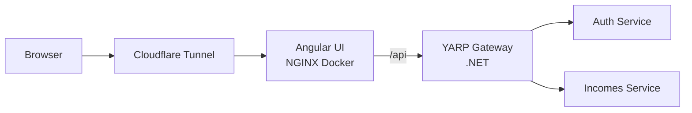
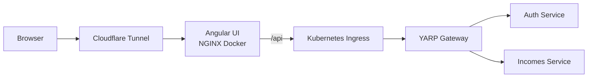

# WiSave Architecture

## Executive Summary

WiSave should evolve toward a gateway-first backend:

- Angular remains a single public frontend at `wisave.app`
- the browser talks only to `/api`
- one gateway hides all backend services
- backend services remain private
- Kubernetes can host backend services, but it does not need to host the frontend on day one

### Final recommendation

The recommended first target is:

`Browser -> Cloudflare Tunnel -> Angular NGINX container -> /api -> YARP gateway -> hidden services`

This is the best fit for the current repo because:

- the frontend already expects one API base URL
- Docker + NGINX + Cloudflare Tunnel are already in place
- YARP can start as a pure forwarding gateway
- backend services can move to Kubernetes without forcing the frontend to move too

## 1. Current State

Today this repo is already set up in a gateway-friendly way:

- Angular 21 SPA
- served by NGINX in Docker
- exposed publicly through Cloudflare Tunnel
- runtime API base URL from `window.__env.API_BASE_URL`
- public deployments use same-origin `/api`
- `/api/*` is reverse-proxied internally only when `BACKEND_UPSTREAM` is configured

Current shape:

```text
Browser
  -> Cloudflare Tunnel
  -> NGINX (Angular UI)
     -> /                Angular static files
     -> /api/*           reverse proxy to BACKEND_UPSTREAM
```

That means the frontend is already aligned with a single-entry backend architecture.

## 2. Architecture Principles

The backend should follow these rules:

1. The browser never calls microservices directly.
2. The browser knows only one public API base: `/api`.
3. The gateway owns routing and cross-cutting concerns.
4. Each service owns its own database.
5. Start with synchronous HTTP. Add async messaging only when needed.
6. Kubernetes is a hosting/platform choice, not the architecture itself.

## 3. Deployment Variants

There are two valid deployment shapes we discussed.

### Option A: Angular outside Kubernetes, YARP outside Kubernetes

```text
Browser
  -> Cloudflare Tunnel
  -> Angular NGINX container
     -> /                Angular UI
     -> /api/*           YARP gateway container
        -> Auth service
        -> Incomes service
        -> Stocks service
```

This is the recommended first step.

Why:

- closest to the current deployment
- least operational complexity
- simplest debugging path
- lets you introduce a proper gateway immediately
- does not force ingress and cluster edge concerns too early

### Option B: Angular outside Kubernetes, YARP inside Kubernetes

```text
Browser
  -> Cloudflare Tunnel
  -> Angular NGINX container
     -> /                Angular UI
     -> /api/*           Kubernetes Ingress
        -> YARP Gateway
           -> Auth service
           -> Incomes service
           -> Stocks service
```

This is a good later evolution if you want the backend platform fully standardized around Kubernetes.

Why not first:

- more moving parts
- more layered routing
- slower feedback loop during early development

### Optional future variant

Later, both Angular and YARP can also move into Kubernetes, but that is not necessary for a good architecture.

## 4. Final Recommended Target

### Phase 1 target

Use Option A:



### Phase 3 target

Backend services and YARP move into Kubernetes together. Angular NGINX stays outside.



YARP moves into the cluster with the other backend services in Phase 3, not later. Keeping YARP outside Kubernetes while the services are inside would require YARP to reach into the cluster, adding unnecessary network complexity.

RabbitMQ and the Stocks service are added in Phase 4, not here.

## 5. Gateway Choice

### Why YARP

`YARP` is the best choice for WiSave if the gateway is part of the `.NET` backend solution.

It works well because:

- it is just an ASP.NET Core app
- it can run in Docker or in Kubernetes
- it can start as pure forwarding only
- it can later take on auth/session responsibilities
- it supports routing, transforms, rate limiting, logging, and policy integration through normal ASP.NET Core primitives

Important clarification:

`YARP` is not a Kubernetes feature. It is a `.NET` application.

So “YARP outside Kubernetes” simply means:

- build a gateway app in `.NET`
- run it as a container on your current host
- proxy requests from Angular NGINX to that container

### When another tool would be better

- Use `Traefik` if you want only infrastructure-level forwarding and do not want a `.NET` gateway project.
- Use `NGINX` only if routing is static and very simple.
- Use `Envoy` or `Kong` only if you need heavier platform/API-management features.

### Final choice

For WiSave:

- best forwarding gateway with future growth into auth/BFF: `YARP`
- best forwarding-only non-.NET proxy: `Traefik`

Because auth is likely to appear and the stack is already leaning .NET, `YARP` is the recommended choice.

### YARP can also proxy non-.NET services

`YARP` only needs a reachable upstream HTTP address, so this is valid:

```text
/api/incomes/* -> .NET service
/api/ai/*      -> Python FastAPI service
/api/reports/* -> Python service
```

## 6. What the Gateway Should Do

### Phase 1 responsibilities

Keep the gateway lean:

- route `/api/incomes/*` to Incomes service
- expose `/api/auth/login`, `/api/auth/logout`, and `/api/auth/me` as gateway-owned ASP.NET Core endpoints
- call the Auth service internally via `HttpClient`
- forward headers
- propagate correlation IDs / trace context
- log requests
- optionally apply rate limiting

Stocks is not in scope for Phase 1. Add its route only when the Stocks service is extracted (Phase 4).

### Later responsibilities

Add these only when needed:

- authentication enforcement
- lightweight authorization policies per route
- lightweight aggregation endpoints

### What not to do

Do not turn YARP into a domain service.

Keep business logic in the backend services, not in the gateway.

## 7. Authentication Strategy

### Best .NET-native option

Use:

- `ASP.NET Core Identity`
- `OpenIddict`

Why:

- `Identity` handles users, passwords, roles, lockout, 2FA support
- `OpenIddict` turns the auth service into a proper OAuth2/OpenID Connect provider

This is better than “Identity + raw JWT only” if the system is expected to grow beyond a trivial setup.

### Recommended frontend auth model

Prefer a gateway/BFF-style session model:

- browser logs in through the auth flow
- gateway maintains a secure server-managed session
- browser calls `/api/...` without handling access tokens directly
- services stay hidden behind the gateway

This is a better fit than storing bearer tokens in the SPA.

WiSave targets the cookie/BFF model from Phase 1. There is no interim token-based step.

### Auth protocol guidance

Best-practice defaults:

- use `OpenIddict` as the token issuer
- use asymmetric signing keys for JWTs
- let upstream APIs validate JWTs through `AddJwtBearer` with the Auth service as authority
- do not share symmetric signing secrets between services unless there is a very specific reason
- do not use implicit flow or password grant

### Session storage

For a single gateway replica in local development, in-memory session storage is acceptable.

For anything beyond that, use a distributed session store:

- `Redis` is the preferred choice
- avoid sticky sessions as the long-term design
- gateway replicas should be stateless apart from distributed session storage

### Cookie settings

Use these defaults for the session cookie:

- `HttpOnly = true`
- `Secure = true` outside local HTTP development
- `SameSite = Lax`
- narrow `Path` and `Domain` as much as possible
- short idle timeout with sliding expiration only if justified

### CSRF protection

Because the browser authenticates with a cookie, CSRF protection is required for unsafe methods.

Best-practice baseline:

- enforce antiforgery validation on `POST`, `PUT`, `PATCH`, and `DELETE`
- require a custom header on unsafe requests
- keep the SPA and gateway on the same origin whenever possible
- do not rely on `SameSite` alone as the only CSRF mitigation

## 8. Backend Services

Suggested first services:

1. `Gateway`
2. `Auth`
3. `Incomes`

Only after those are stable:

4. `Stocks`
5. `Notifications`
6. `Imports`
7. `Analytics`

### Incomes Service

The first extracted service should preserve the current frontend contract:

- `GET /incomes`
- `GET /incomes/{id}`
- `GET /incomes/total-amount`
- `GET /incomes/categories`
- `GET /incomes/stats`
- `GET /incomes/monthly-stats`
- `POST /incomes`
- `PUT /incomes/{id}`
- `DELETE /incomes/{id}`

### Auth Service

Responsibilities:

- register
- own the user store and identity data
- issue JWTs through `OpenIddict`
- expose internal token/authorization endpoints used by the gateway
- handle refresh/session-renewal mechanics behind the gateway
- publish signing metadata and discovery endpoints for API token validation

The Auth Service does not expose browser-facing login/logout/session endpoints directly. In the BFF model those endpoints are owned by the gateway:

- `/api/auth/login` -> gateway endpoint
- `/api/auth/logout` -> gateway endpoint
- `/api/auth/me` -> gateway endpoint

### Stocks Service

Keep this simple initially. It does not need to be extracted before the platform is stable.

## 9. Service-to-Service Communication

### Synchronous communication

Start with `HTTP REST`.

Use it for:

- straightforward request/response interactions
- low-complexity internal integration
- frontend-facing APIs

### gRPC

Use `gRPC` only when there is a concrete reason:

- hot internal path
- strongly typed contracts between services
- streaming or lower-overhead internal calls

Do not start with gRPC by default.

### Asynchronous communication

When async flows appear, use:

- `RabbitMQ`
- `MassTransit`

This is the pragmatic small-platform choice for .NET microservices.

Use it for:

- notifications
- audit-style events
- background jobs
- cross-service projections
- long-running workflows

### Data ownership

Each service should own its own database.

Do not share one database across all services if the goal is real service boundaries.

### Reliability

If you publish events, implement the outbox pattern.

## 10. Kubernetes Role

Kubernetes is useful here, but it should be introduced for the backend platform, not as a forced requirement for every component on day one.

### Good use of Kubernetes in WiSave

- host backend services
- host RabbitMQ
- host PostgreSQL if you want the operational exercise
- provide service discovery
- provide deployment, restart, health, and scaling mechanics

### What Kubernetes does not replace

Kubernetes does not replace:

- application gateway design
- auth design
- service boundaries

Those remain application architecture concerns.

## 11. Security and Operational Baseline

The platform should follow these defaults from the start:

- use HTTPS on every public hop
- keep all business services private
- expose only the frontend and the gateway entrypoint
- keep signing keys, DB passwords, and client secrets out of source control
- use Kubernetes Secrets or an external secret store for production
- rotate credentials and signing keys
- publish health endpoints for every service
- use readiness probes so traffic does not hit half-started services
- add structured logs and distributed tracing from the first gateway/service extraction

### Service authorization model

Each upstream service validates the bearer token itself.

Do not trust the gateway alone for authorization. The gateway enforces entry policies, but the service must still validate:

- token signature
- issuer
- audience
- expiry
- required scopes or roles

### Timeouts and retries

Use explicit outbound policies from the gateway:

- short request timeouts
- bounded retries only for idempotent operations
- circuit breaking for unstable dependencies
- no blind retries on writes unless the operation is idempotent

### Messaging reliability

When RabbitMQ is introduced:

- use MassTransit
- use the outbox pattern
- make consumers idempotent
- version events intentionally
- do not use the message bus for simple request/response traffic

## 12. Recommended Kubernetes Shape

When the backend moves into Kubernetes, this is the recommended shape:

- `edge` namespace
  - ingress controller
  - optional cloudflared
- `wisave` namespace
  - yarp gateway
  - auth service
  - incomes service
  - stocks service
  - rabbitmq
- `data` namespace
  - postgres instances or operator-managed databases
- `observability` namespace
  - otel collector
  - grafana
  - prometheus
  - loki or seq

### Ingress responsibility

If YARP is inside the cluster:

- ingress handles public cluster entry
- ingress forwards `/api` to YARP
- YARP forwards to internal services

Do not make ingress and YARP compete for the same responsibility.

## 13. .NET Solution Structure

Suggested backend solution:

```text
wisave-backend/
  WiSave.sln
  src/
    WiSave.Gateway/
    WiSave.Auth/
    WiSave.Incomes/
    WiSave.Stocks/
    WiSave.Shared.Contracts/
    WiSave.Shared.Observability/
    WiSave.Shared.ServiceDefaults/
  tests/
    WiSave.Auth.Tests/
    WiSave.Incomes.Tests/
    WiSave.Stocks.Tests/
    WiSave.Integration.Tests/
  deploy/
    docker/
    k8s/
    helm/
  scripts/
```

### Shared libraries

Keep shared code minimal.

Good shared areas:

- contracts
- observability
- service defaults
- messaging abstractions

Avoid putting domain logic into a shared package.

### WiSave.Shared.ServiceDefaults

This is a plain `.NET` class library, not a .NET Aspire project (Aspire is not in scope here).

It provides a single `AddServiceDefaults(this IHostApplicationBuilder builder)` extension method that every service calls in `Program.cs`. It wires up the common baseline:

- OpenTelemetry (traces, metrics, logs exported via OTLP)
- health check endpoints (`/health`, `/alive`)
- standard `HttpClient` resilience policies (retry, timeout)
- structured logging configuration

This keeps each service's `Program.cs` short and ensures the observability baseline is consistent across all services.

## 14. YARP Routing Shape

The frontend calls `/api/incomes/*`. The upstream Incomes service listens at `/incomes/*`, not `/api/incomes/*`. YARP must strip the `/api` prefix before forwarding, otherwise every request will 404 at the upstream.

Use the `PathRemovePrefix` transform for this:

```json
{
  "ReverseProxy": {
    "Routes": {
      "incomes-route": {
        "ClusterId": "incomes-cluster",
        "Match": { "Path": "/api/incomes/{**catch-all}" },
        "Transforms": [{ "PathRemovePrefix": "/api" }]
      }
    },
    "Clusters": {
      "incomes-cluster": {
        "Destinations": {
          "primary": { "Address": "http://incomes-service:8080/" }
        }
      }
    }
  }
}
```

Result after transform:

```text
/api/incomes/123  ->  http://incomes-service:8080/incomes/123
```

There is no auth route in the YARP proxy config. Auth endpoints are gateway-owned ASP.NET Core endpoints (see below). The Auth service is not reachable through YARP — the gateway calls it internally via `HttpClient`.

The Stocks route is not included in Phase 1. Add it when the Stocks service is extracted (Phase 4).

### No fallback route

There is intentionally no catch-all route. Any unmatched `/api/*` path returns a 404 from YARP. This is correct — callers should not silently reach an undefined destination. If you want an explicit error body, add a catch-all route pointing to a local minimal handler in the gateway itself:

```json
"fallback-route": {
  "ClusterId": "fallback-cluster",
  "Match": { "Path": "/api/{**catch-all}" },
  "Order": 100
}
```

### Auth routing and the BFF session model

Auth endpoints are ASP.NET Core minimal API endpoints registered directly in the gateway — they are not YARP proxy routes. There is no auth cluster in the YARP config.

```text
/api/auth/login    gateway endpoint  -> calls Auth service via HttpClient -> sets HttpOnly cookie
/api/auth/logout   gateway endpoint  -> clears session cookie
/api/auth/me       gateway endpoint  -> reads session, returns current user
/api/incomes/*     YARP proxy route  -> Incomes service
```

Flow on login:

1. Browser POSTs credentials to `/api/auth/login`
2. Gateway forwards them to the Auth service token endpoint via `HttpClient`
3. Auth service (OpenIddict) issues a JWT access token
4. Gateway stores the access token server-side in a session, sets a secure `HttpOnly` session cookie on the browser response
5. Browser stores nothing — it only holds the session cookie

Flow on subsequent API calls:

1. Browser calls `/api/incomes` with the session cookie
2. Gateway reads the access token from the server-side session
3. Gateway forwards `Authorization: Bearer <token>` to the Incomes service
4. Incomes service validates the JWT using `AddJwtBearer` middleware, with the Auth service as the OpenID Connect authority

**Internal token format:** standard JWT issued by OpenIddict. Upstream services validate it independently using `AddJwtBearer` — they do not know about the gateway session. The gateway is the only component that touches the session cookie; upstream services only see the bearer token.

The SPA never sees or stores an access token.

## 15. Request Lifecycle

### Recommended phase 1 lifecycle

```text
1. Browser calls https://wisave.app/api/incomes?page=1
2. Cloudflare Tunnel forwards to Angular NGINX
3. Angular NGINX proxies /api to YARP
4. YARP matches /api/incomes/*
5. YARP forwards to Incomes service
6. Incomes service responds
7. Response returns through YARP -> NGINX -> Tunnel -> Browser
```

### Later lifecycle with backend in Kubernetes

```text
1. Browser calls https://wisave.app/api/incomes?page=1
2. Cloudflare Tunnel forwards to Angular NGINX
3. Angular NGINX proxies /api to Kubernetes Ingress
4. Ingress forwards /api to YARP
5. YARP forwards to Incomes service
6. Incomes service responds
7. Response returns back to the browser
```

## 16. Observability

Recommended baseline:

- OpenTelemetry
- central OTLP collector
- Prometheus + Grafana for metrics
- Loki or Seq for logs
- distributed tracing for gateway and service calls

Introduce observability early enough to understand routing and service boundaries, but do not let it block the first gateway/service extraction.

## 17. Local Development Topology

### Current state (frontend only)

The repo currently contains only the Angular frontend. There is no backend yet.

The active frontend is an Nx application at `apps/wisave-ui`. Runtime API configuration lives in `libs/platform/config`, and the local default resolves to `/api`. `yarn start` runs `nx serve wisave-ui`, whose development configuration uses `proxy.conf.json` to forward `/api` requests to the portal on `http://localhost:5100`.

### Domain Shell Libraries

Domains with multiple routed slices expose a shell library as the app-facing entry point. The app imports the shell only. The shell composes same-domain feature/plugin slices.

Example:

```text
apps/wisave-ui -> @wisave/expenses/shell
@wisave/expenses/shell -> @wisave/expenses/list
@wisave/expenses/shell -> @wisave/expenses/budget
@wisave/expenses/shell -> @wisave/expenses/accounts
```

Feature/plugin slices must not import sibling slices. Shared state/contracts belong in `libs/shared/*`, `libs/platform/*`, or the domain data-access library when domain-specific.

### Recommended local dev topology (best practice)

Once the backend exists, local development should switch to same-origin `/api` calls through the Angular dev server.

Recommended setup:

- set frontend local `API_BASE_URL` to `/api`
- keep `proxy.conf.json` wired through the `wisave-ui` Nx project development serve target
- run the frontend with `yarn start` or `yarn nx serve wisave-ui`
- proxy `/api` to the YARP gateway on `http://localhost:5100`

Why this is the preferred model:

- matches production more closely
- avoids CORS in local development
- avoids credential-mode edge cases for cookie auth
- keeps BFF/session behavior simple

If you temporarily use a cross-origin `http://localhost:5100/api` model, then you must explicitly configure:

- credentialed CORS on the gateway
- cookie settings suitable for local development
- frontend requests to include credentials

Those are fallback requirements, not the preferred design.

```text
Browser (localhost:4200)
  -> Angular dev server (nx serve wisave-ui)
     -> /api/* via Angular proxy -> YARP gateway (localhost:5100)
        -> Auth service    (localhost:5101)
        -> Incomes service (localhost:5102)

Databases
  -> postgres-users   (localhost:5432)
  -> postgres-incomes (localhost:5433)
```

`docker-compose.dev.yaml` wires the backend up:

```yaml
services:
  yarp-gateway:
    build: { context: ., dockerfile: docker/Dockerfile.gateway }
    ports: ["5100:8080"]
    environment:
      ReverseProxy__Clusters__incomes-cluster__Destinations__primary__Address: http://incomes-service:8080/
      AuthService__BaseUrl: http://auth-service:8080/
    depends_on: [auth-service, incomes-service]

  auth-service:
    build: { context: ., dockerfile: docker/Dockerfile.auth }
    ports: ["5101:8080"]
    environment:
      ConnectionStrings__Default: Host=postgres-users;Database=wisave_users;Username=wisave;Password=wisave
    depends_on: [postgres-users]

  incomes-service:
    build: { context: ., dockerfile: docker/Dockerfile.incomes }
    ports: ["5102:8080"]
    environment:
      ConnectionStrings__Default: Host=postgres-incomes;Database=wisave_incomes;Username=wisave;Password=wisave
    depends_on: [postgres-incomes]

  postgres-users:
    image: postgres:16-alpine
    ports: ["5432:5432"]
    environment: { POSTGRES_USER: wisave, POSTGRES_PASSWORD: wisave, POSTGRES_DB: wisave_users }

  postgres-incomes:
    image: postgres:16-alpine
    ports: ["5433:5432"]
    environment: { POSTGRES_USER: wisave, POSTGRES_PASSWORD: wisave, POSTGRES_DB: wisave_incomes }
```

> **Local dev only.** The credentials above are placeholder values. Do not reuse them in staging or production configs.

Recommended Angular dev proxy:

```json
{
  "/api": {
    "target": "http://localhost:5100",
    "secure": false,
    "changeOrigin": true,
    "logLevel": "info"
  }
}
```

## 18. Implementation Plan

### Phase 1: Gateway-first foundation

- create `.NET` backend solution
- create `WiSave.Gateway` with YARP
- route `/api/incomes` via YARP with `/api` prefix stripping
- implement BFF/cookie session from the start: `/api/auth/login`, `/api/auth/logout`, and `/api/auth/me` are gateway-owned ASP.NET Core endpoints; gateway calls the Auth service internally, sets an `HttpOnly` session cookie, and forwards the JWT as a bearer token to upstream services
- add Angular local dev proxy so the frontend uses same-origin `/api` during development
- enforce CSRF protection for unsafe methods at the gateway
- keep Angular Docker deployment unchanged except `/api` now targets YARP
- build `Auth` service with `ASP.NET Core Identity + OpenIddict`
- extract `Incomes` service
- wire up `WiSave.Shared.ServiceDefaults` in all services (OTel OTLP export from day one)
- local development with Docker Compose (see section 17)

### Phase 2: Hardening and user context

- add user context propagation (forward verified user identity to upstream services)
- add per-route authorization enforcement at the gateway
- session renewal and logout across services
- move session storage to Redis before scaling the gateway past one replica

### Phase 3: Backend platform in Kubernetes

- move YARP and all backend services into Kubernetes together
- add ingress controller; ingress forwards `/api` to YARP inside the cluster
- deploy PostgreSQL as StatefulSets with PVCs
- add readiness/liveness probes on all services
- move Cloudflared to a K8s Deployment

### Phase 4: Async integration and Stocks

- add RabbitMQ + MassTransit
- extract Stocks service
- introduce background workflows and domain events
- outbox pattern for reliable event publishing

### Phase 5: Platform maturity

- full observability stack (OTel Collector, Grafana dashboards, Loki/Prometheus)
- CI/CD pipeline (GitHub Actions → build images → deploy to K8s)
- alerts and runbooks

## 19. Technology Choices Summary

| Concern | Choice | Why |
|---------|--------|-----|
| Frontend public entry | Angular + NGINX + Cloudflare Tunnel | Already in place, simple same-origin deployment |
| Gateway | YARP | Best fit for .NET stack, starts simple, can grow into auth/BFF |
| Auth | ASP.NET Core Identity + OpenIddict | .NET-native, stronger than raw Identity + ad hoc JWT |
| Sync communication | HTTP first | Lowest complexity |
| Async communication | RabbitMQ + MassTransit | Pragmatic .NET choice |
| Service runtime | .NET 10 Minimal APIs | Lightweight and fast to build |
| Database | PostgreSQL | Strong default choice |
| Orchestration | Kubernetes for backend | Good learning platform, but not required for frontend on day one |
| Observability | OpenTelemetry + Grafana stack | Standard, flexible, vendor-neutral |

## 20. Final Decisions

The final architecture decision after discussion is:

1. Keep Angular outside Kubernetes for now.
2. Introduce YARP as the single backend gateway.
3. Use `/api` as the only browser-visible backend entrypoint.
4. Keep microservices hidden.
5. Implement BFF/cookie session from Phase 1 — no interim token-based step.
6. Add auth through `.NET Identity + OpenIddict`.
7. The gateway owns login/logout; the SPA never handles tokens.
8. Use same-origin `/api` in local dev via Angular proxy; do not rely on cross-origin cookie auth as the primary dev model.
9. Use Redis-backed sessions before scaling the gateway beyond one replica.
10. Move YARP and backend services into Kubernetes together in Phase 3.
